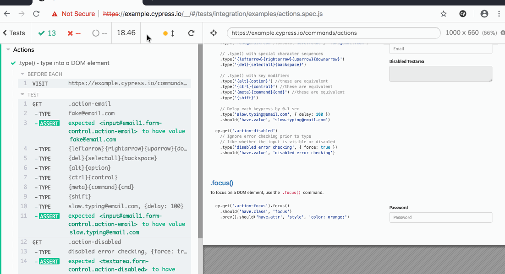

# Cypress for E2E Testing
_This blog is part of a series on end-to-end (E2E) testing in Cypress. Future posts will expound upon how my team uses Cypress and technicals around using Cypress. This information is available in [this presentation](https://cypress-retro.micleners.com/) I give on the topic. You can also check out a demo application with Cypress at [this repo](http://github.com/micleners/cypress-cotd)._

## A (Mostly) Nontechnical Overview of the Platform and Its Uses

If you've worked with Angular, you have probably seen Protractor as the end-to-end (E2E) testing solution provided when you run ng new a project. If you have ever worked with Protractor or other Selenium based solutions, you have likely been frustrated with the experience.

Our team chose to go towards greener, more JS-based pastures by opting to use Cypress instead of Protractor. Was the grass greener on the other side? We sure think so! Here's been our experience.

_Note: E2E testing can sometimes be referred to as user interface (UI) testing - because the UI is the entry point at one end (the database is typically the other end). I may use these terms interchangeably but will make a distinction between our use case later in this or other articles._

### What is Cypress?

Cypress is "fast, easy and reliable testing for anything that runs in a browser". It is batteries included with baked-in features and perks. Cypress has a strong user community and great documentation.

It also has limitations. Most notably, Cypress currently only supports Chrome. It also comes with inherent concerns that all shiny and new open source projects have—what if the next hot thing comes out and maintainers jump ship? Not likely, and the same thing could happen with Protractor as we have seen with [tslint](https://github.com/palantir/tslint/issues/4534).

### What will it cost me?

Cypress has a super generous free tier. You can <conde>npm install cypress</code> and get started writing tests in no time. Then hop into the test runner and go back in time to see what happened at each point in your tests. The image below shows some of the test runner capabilities.

For more information on Cypress, visit the [Cypress.io website](https://www.cypress.io/features) for an easy to get going tutorial, check out this [Web Dev Studios Blog](https://webdevstudios.com/2018/11/13/end-to-end-testing-with-cypress-io/).

The free tier also provides the capability to take screenshots, record videos, and output reports. Not to mention all the baked-in test development tools like cypress commands, traffic control, aliasing, and dropping into jQuery attributes or Mocha assertions as needed.

The benefits of the paid tier of Cypress are pretty straightforward: a dope, magical dashboard with a history of your test runs, including those videos and screenshots mentioned above. We figured out how to extract these into our pipeline.

### Bad rap for E2E testing

End-to-end testing has a fraught history of being flaky and unreliable. Software always has a chance of misfiring and crashing. Additionally, running software in a browser with HTTP requests increases the odds that something will go wrong.
Sometimes requests don't come through. Sometimes it takes 0.3 seconds for that element to appear on the DOM. Sometimes it never appears. As test suites grow, the likelihood of all tests passing in a single run diminishes. We can try to wrangle instability in Selenium-based solutions with waits, but then sometimes things never return. Then we have to do error handling and <strong>_Ack!</strong> I'm going home!_

Cypress mitigates a lot of these headache points with:

- Auto retry capability
- Sweet debugging capabilities
- Traffic control for flaky API calls
- Wait helpers for DOM elements and XHR requests

### Why automate E2E testing?

Many development teams opt not to automate end-to-end tests. Besides the flakiness discussed above, it's another test suite the team needs to manage. On our project, we were already using unit tests in Jest on the frontend, unit tests in MSTest on the back end, and SpecFlow to acceptance test our API.

Additionally, many developers and QA engineers adopt the [testing pyramid approach](https://martinfowler.com/bliki/TestPyramid.html). The basics of this school of thought is to have a majority of your tests unit tests (~70%), then have even fewer integration tests (~20%), and finally, the smallest test amount of tests in end-to-end (10%). This is because higher-level tests are more costly and flaky to run.
 
So, what is the value of adding E2E tests? Just like any testing, it can help inform the development process and can help catch defects quickly after development. We've also found doing E2E tests has tightened the communication loop between development and QA.

Possibly the most important factor is that your E2E test suite serves as a regression test suite. As you add more and more features, this decreases the burden of rigorously and manually regression testing old features. Our efforts can be focused on creating test cases for new features and exploratory/smoke testing as needed.

### What tests can Cypress replace?

Cypress accesses your application through the browser, therefore it is most suitable for end-to-end acceptance tests or UI tests. If you are interested, Cypress can be used to [unit test your components in Angular](https://medium.com/joolsoftware/unittesting-angular-components-with-cypress-202a38d9f81a) with some home-brewing. Considering the UI access point, Cypress is not appropriate for API testing.

On our team, we experienced many challenges using TestBed for UI testing. This, along with a desire to E2E test, were strong motivators for trying Cypress. Now that we have fully adopted Cypress, we have ditched the use of TestBed. In Jest tests, we only test controller level logic. We then reserve Cypress for UI (mocked API calls) and E2E (real API calls) tests. We will discuss this further in subsequent posts.

### Conclusion

Cypress is a really exciting tool that helps developers get into end-to-end testing fast. It has brought a lot to our team and our process. It has brought our team closer regarding communication around feature expectations. It has provided us with a tool to catch defects as they are being generated. Possibly most importantly, it has created a regression testing suite that helps us feel assured that we have not negatively affected any previous features when implementing new ones.

Cypress also offers a breadth of helpful features allowing developers to dive into E2E testing without having to deal with the minutiae of creating a Page Object Model and writing complex waiting helpers. Lastly, the value of the interactive test runner, screen-shot and video output makes this tool highly valuable to non-developer members of our team.

Stay tuned for more blog posts to come on the topic of Cypress around technical nuances of Cypress and how our team has integrated Cypress into our flow.
